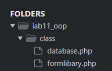
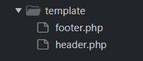
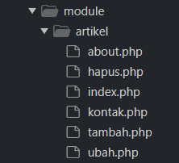

`Nama  : Faizah Via Fadhillah`

`Nim   : 312210460`

`Kelas : TI22.A4`

# Praktikum 11

1. Salin file `database.php` dan file `formlibary.php` dari praktikum 10, lalu letakan pada folder `class`

    

2. Buat folder `config` dan folder `Css` untuk menyimpan file `config.php` dan file `style.css`

    

    

3. Buat folder `template` yang berisi file `header.php` dan `footer.php`

    

4. Buat `module` `artikel` yang berisi `CRUD` dengan memanfaatkan library database dan form tersbut.

    

*  File `index.php` berisi proses routing aplikasi dan dikombinasikan dengan penggunaan mod_rewrite pada file .htaccess